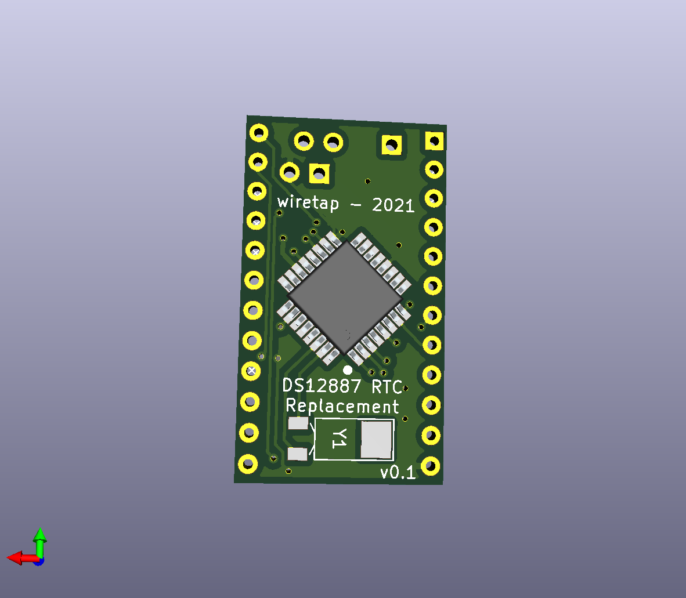
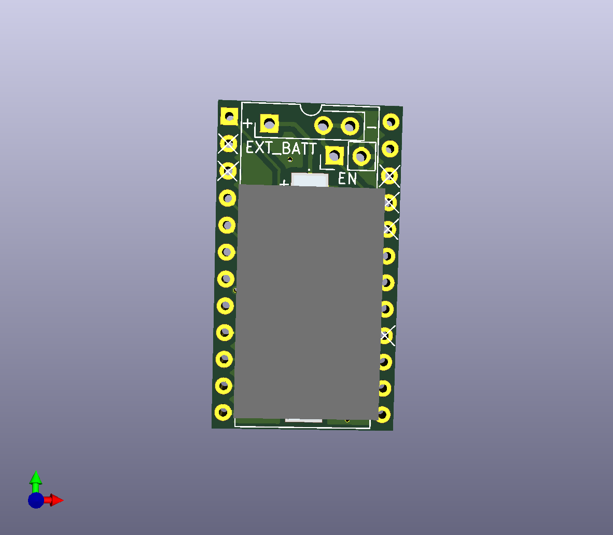

# Dallas DS12887 RTC Replacement
A simple Dallas DS12887 replacement board with enable/disable function and ext_batt header.

\

## Info
This Dallas DS12887 replacement utilizes a DS12885T+ TQFP-32 chip and a CR1220 battery holder. There is an enable/disable pin for you to save battery while the computer is in storage, and there's also an EXT_BATT header for hooking up an external battery holder if you don't want to use the CR1220 batteries.

## Compatibility
Compatible with DS12887, DS1285 and DS1287 RTC's. Check datasheet for additional info: https://www.mouser.com/datasheet/2/256/DS12885-DS12C887A-1512672.pdf
